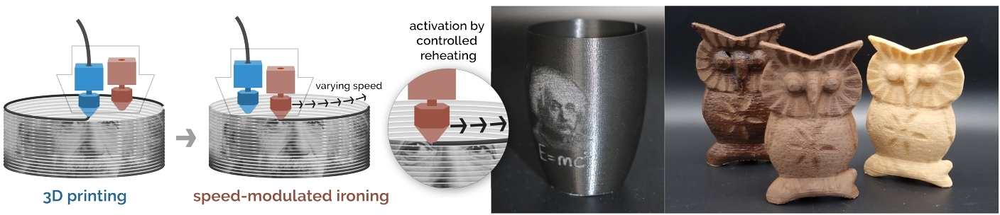

Speed\-Modulated Ironing: High\-Resolution Shade and Texture Gradients in Single\-Material 3D Printing
======================================================================================================

**We present Speed\-Modulated Ironing, a new fabrication method for programming visual and tactile properties in single\-material 3D printing. We use one nozzle to 3D print and a second nozzle to reheat printed areas at varying speeds, controlling the material's temperature\-response. The rapid adjustments of speed allow for fine\-grained reheating, enabling high\-resolution color and texture variations. We implemented our method in a tool that allows users to assign desired properties to 3D models and creates corresponding 3D printing instructions. We demonstrate our method with three temperature\-responsive materials: a foaming filament, a filament with wood fibers, and a filament with cork particles. These filaments respond to temperature by changing color, roughness, transparency, and gloss. Our technical evaluation reveals the capabilities of our method in achieving sufficient resolution and color shade range that allows surface details such as small text, photos, and QR codes on 3D\-printed objects. Finally, we provide application examples demonstrating the new design capabilities enabled by Speed\-Modulated Ironing.**

 

*Figure 1: Speed\-Modulated Ironing is a novel 3D printing technique for FDM 3D printers to continuously program visual and tactile properties at a high resolution. It works by using one nozzle to lay down the filament, followed by the second nozzle that activates the temperature response of the material by "ironing" the printed layer at varying speeds, changing the achieved property. Our method can be used for different temperature\-responsive filaments.*

 [Mehmet Ozdemir](https://orcid.org/0000-0002-5177-807X), Delft University of Technology, Netherlands, 
 [Marwa AlAlawi](https://orcid.org/0000-0003-3053-6861), MIT CSAIL, United States,
 [Mustafa Doga Dogan](https://orcid.org/0000-0003-3983-1955), MIT CSAIL, United States and Boğaziçi University, Turkey,
 [Jose Francisco Martinez Castro](https://orcid.org/0000-0003-3100-9705), Delft University of Technology, Netherlands and Delft University of Technology, Netherlands,
 [Stefanie Mueller](https://orcid.org/0000-0001-7743-7807), MIT CSAIL, United States,
 [Zjenja Doubrovski](https://orcid.org/0000-0003-2785-3452), Delft University of Technology, Netherlands

DOI: [https://doi.org/10\.1145/3654777\.3676456](https://doi.org/10.1145/3654777.3676456)
  
UIST '24: [The 37th Annual ACM Symposium on User Interface Software and Technology](https://doi.org/10.1145/3654777), Pittsburgh, PA, USA, October 2024

